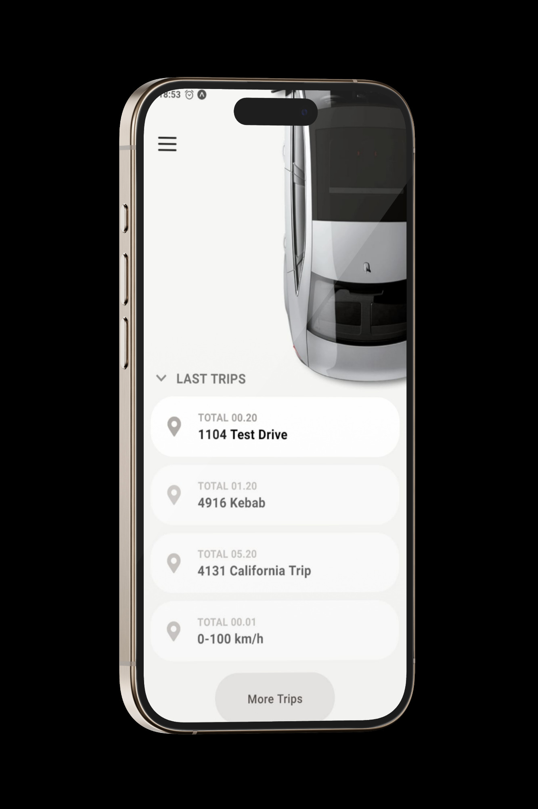

## Modern banking application UI with React Native and Tailwind CSS

Recently, I developed an electric vehicle management application interface using React Native, Tailwind, and TypeScript. Focusing on user experience, I translated a clean design into functional code. The app brings an existing design to life.

### Views:

    
        
        

    
   

